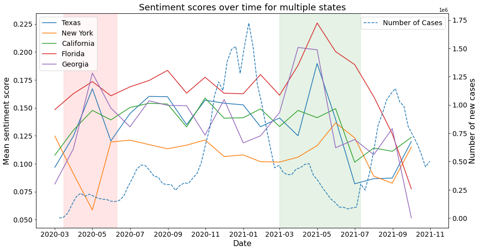
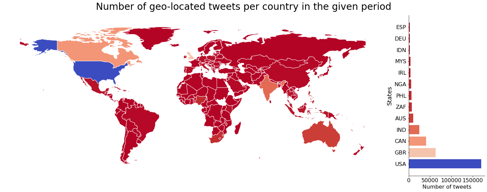

# SocialWebFinal
Final assignment of the SocialWeb course at the Vrije Universiteit Amsterdam. 

Students:
1. Roman Peerboom
2. Sam Kuilboer
3. Gabor Banyai
4. Enrico Menarini

RQ: Is there a correlation between sentiment for Twitter data and vaccination rate in the US and UK (specify date)? 
1. How is the data-set distributed over the globe?
2. How is the data-set distributed within the US?
3. How does the sentiment analysis change over time?
4. What are the vaccination rates in every state?

Some of the figures generated to answer this questions are shown as example below. The full article can be requested by sending a message to the owner of the repository.

### Example figures

The first figure is to show the sentiment analysis over time. Two time periods stand out and are colorized to draw attention.

The second figure shows the number of tweets from a certain country.

